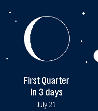
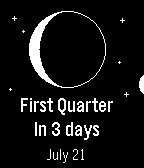
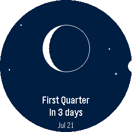

<div align="center">

# 🌙 Moon Phase

**See the Moon exactly as it looks in the sky tonight — right on your wrist.**

[](https://apps.repebble.com/86a2d34ade9646dfb84d51af)
[](https://github.com/loxK/Pebble-Moon-Phase/releases/latest)
[](https://github.com/loxK/Pebble-Moon-Phase/releases/latest/download/moon-phase.pbw)
[](https://github.com/loxK/Pebble-Moon-Phase/actions/workflows/release.yml)
[](LICENSE)



</div>

Moon Phase draws the Moon the way you'd actually see it — the real illuminated
shape, oriented for your hemisphere — then tells you what's next and when.
No phone required: everything is computed on the watch.

## Get it

- 📲 **[Install from the Pebble App Store](https://apps.repebble.com/86a2d34ade9646dfb84d51af)** — the easy way.
- ⬇️ Or grab the latest **[`moon-phase.pbw`](https://github.com/loxK/Pebble-Moon-Phase/releases/latest/download/moon-phase.pbw)** and sideload it.

## Features

- 🌒 **The real Moon** — the current phase drawn as a crisp disc, lit exactly
  like the sky above you.
- ⏳ **Next phase, at a glance** — *“In 4 days”* and the date, front and center.
- 📜 **What's coming** — press **SELECT** for the upcoming new, first‑quarter,
  full and last‑quarter dates.
- 🧭 **Hemisphere aware** — the crescent flips for the Southern hemisphere,
  set automatically from your location.
- 🌍 **Speaks your language** — English, French, German, Spanish, Italian,
  Portuguese and Chinese, with local date formats.
- 🗓️ **In your Timeline** — upcoming phases show up as pins.
- 🎯 **Accurate & offline** — a proper astronomical model, good to the minute.

## Screenshots

<div align="center">

&nbsp;&nbsp;

&nbsp;&nbsp;


<sub>Black &amp; white · Pebble Time 2 · round — one app, every Pebble.</sub>

</div>

## Build from source

```sh
pebble build
pebble install --emulator emery      # try it in the emulator
pebble install --phone <ip>          # install to your watch
```

Press **SELECT** from the watchface app to open the list of upcoming phases.
Long‑press **SELECT** to flip the hemisphere by hand.

## Download & verify

Every [release](https://github.com/loxK/Pebble-Moon-Phase/releases/latest) ships
the compiled `moon-phase.pbw` together with its **SHA-256** (`moon-phase.pbw.sha256`).
It's the same build that's published to the Pebble App Store, so you can confirm
the file you got is authentic and untampered:

```sh
sha256sum -c moon-phase.pbw.sha256        # -> moon-phase.pbw: OK
```

The checksum is also printed in each release's notes.

## License

Copyright © 2026 Laurent Dinclaux &lt;laurent@knc.nc&gt;

Released under the **GNU Affero General Public License v3.0 or later**
(AGPL‑3.0‑or‑later). See [`LICENSE`](LICENSE).

---

Built with 🥥 and ☕ by Lox — Kanaky-New Caledonia 🇳🇨
